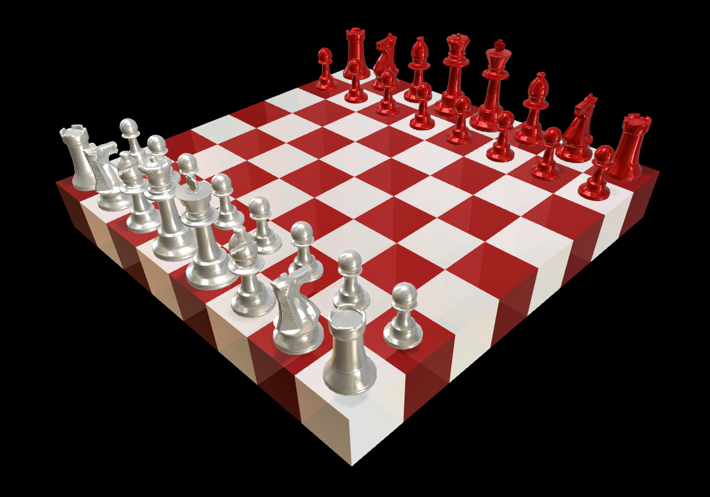

# Chess Mashup

[Play amusing chess variants in beautiful 3D.](https://charles0830.github.io/chess-mashup/)

The available games may not match the list below,
since this document was written largely prospectively.

## Chess On a Cube

(8³ cube = 512 voxels, 8×8×6 surface area = 384 spaces)

Finally, a perfect information game with poor visibility.

No fog of war, or anything *silly* like that. 🌫️⚔️💣
Sure there's *3-D chess* and *N-D chess*, where it's hard to wrap your head around it, 🤯  
but in this game, it's hard to hard to wrap your *eyes* around it. 👀  
It's innovative. 🍷🤔

Some may say this cube seems too big,
but I say it seems almost impossible to design a reasonable starting arrangement for a cube like this.

or...

## Frankenstein's Board Game, or: What Game Should We Play?

Board game mashup. How many abstract board games can you play on the same board?
How many rule sets can you combine?

♟️♙️♖️♘️♗️♔️♕️🃏🎲👾🅂🄲🅁🄰🄱🄱🄻🄴🎯🎱🎳🎮⬮⬯●○⬬⬭⬬⬭⬬⬭

or...

## Non-Euclidean Chess

In the game of Chess, pawns can advance to the eighth rank and promote to a queen.
In Non-Euclidean Chess, there's another way to upgrade pieces, but it's not what you're used to.
If a piece goes through a portal, it can come out the other side onto the same board but twice the size,
because the exit portal is twice as large as the entry portal, and thus it stretches the piece.

Big pieces can capture four small pieces in a single move.

If you go the other direction, you can end up with a tiny piece.
What can a tiny piece do? I don't know. It can hide.

What if the exit portal is wider than the entry portal?
You get a wide piece, taking up 2x1 space.

If you've ever played [Problem Sleuth], this should be no problem for you.

## Development Setup

This project is built with [ThreeJS], a popular JavaScript library for 3D graphics.

- Install Git if you don't already have it.
- [Clone the repo.][git clone]
- Install [Node.js][] if you don't have it, then open up a command prompt / terminal in the project directory.
- Install project dependencies with `npm install`
- `npm start` will start a web server which will watch for changes to the source files and automatically reload the page.

## License

[MIT license](LICENSE.txt)

[Problem Sleuth]: https://www.homestuck.com/problem-sleuth/1
[ThreeJS]: https://threejs.org/
[Node.js]: https://nodejs.org/
[git lfs install]: https://help.github.com/en/github/managing-large-files/installing-git-large-file-storage
[git clone]: https://help.github.com/articles/cloning-a-repository/
